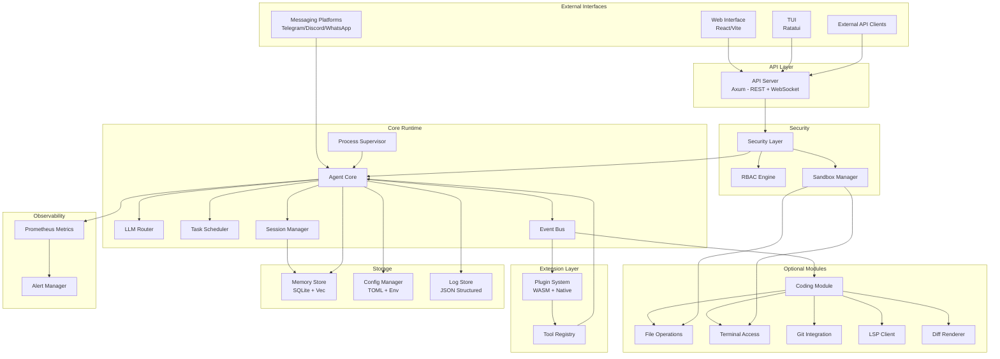
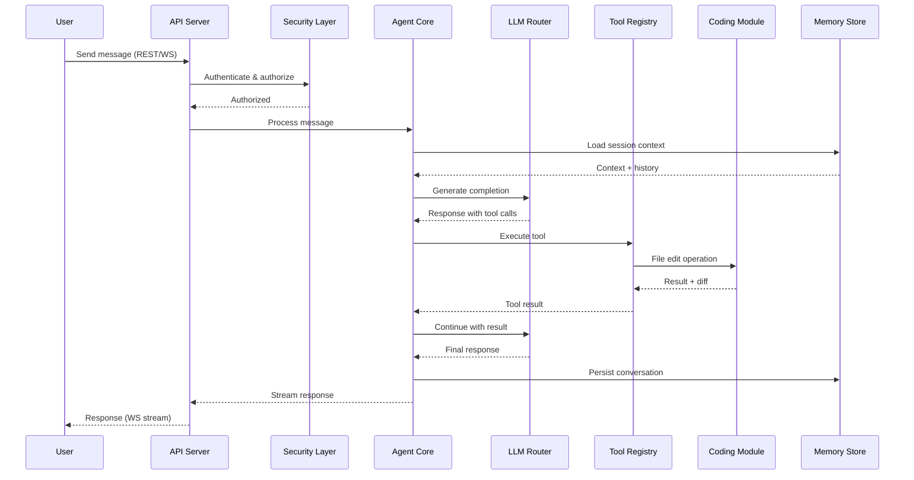
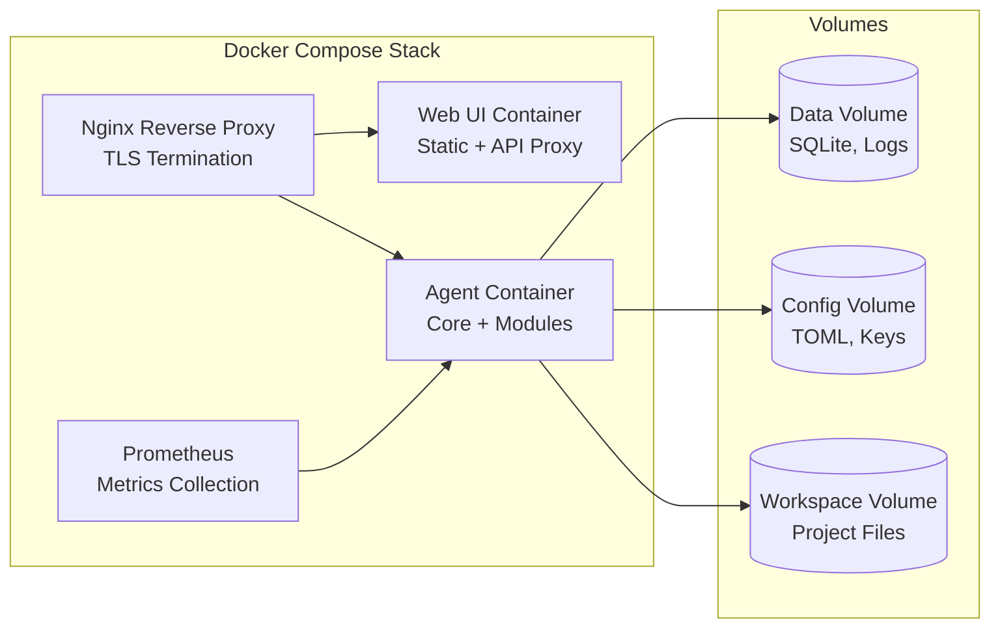

# Design Document: VPS AI Agent Platform

## Overview

The VPS AI Agent Platform is a modular, always-on AI agent system designed for deployment on virtual private servers. It provides two operational modes: a base "General Agent" mode for 24/7 task automation, monitoring, and scheduled operations, and an optional "Coding Agent" mode that adds software development capabilities including file editing, terminal access, LSP integration, git operations, and visual diff rendering.

The platform is built as a set of loosely coupled services orchestrated via Docker Compose (primary) or systemd (bare-metal), communicating through an internal event bus and shared state stores. The architecture prioritizes reliability (99.5% uptime target), security (sandboxed execution, RBAC), and extensibility (plugin system, multiple LLM providers).

### Key Design Decisions

1. **Rust for core runtime** — Memory safety, low resource footprint (512MB idle target), and excellent async support via Tokio make Rust ideal for the always-on agent core, process supervisor, and security layer.
2. **TypeScript/React for Web Interface** — Standard choice for responsive web UIs with WebSocket support.
3. **SQLite + Vector Extension for Memory Store** — Lightweight, file-based persistence suitable for VPS deployment without requiring a separate database server. The `sqlite-vec` extension provides vector search for semantic memory queries.
4. **Event-driven internal architecture** — Components communicate via an async channel-based event bus, enabling loose coupling and hot-reloading of plugins.
5. **gRPC for internal service communication** — Typed, efficient communication between the agent core and optional modules (coding, messaging).
6. **TOML for configuration** — Human-readable, well-supported in Rust, with environment variable override support.

### Technology Stack

| Layer | Technology | Rationale |
|-------|-----------|-----------|
| Agent Core / Runtime | Rust (Tokio) | Low memory, safety, async |
| LLM Router | Rust | Performance-critical path |
| Web Interface | TypeScript, React, Vite | Modern SPA with WebSocket |
| TUI | Rust (Ratatui) | Native terminal rendering |
| API Server | Rust (Axum) | High-performance HTTP/WS |
| Memory Store | SQLite + sqlite-vec | Lightweight vector search |
| Task Scheduler | Rust (tokio-cron-scheduler) | Cron + event triggers |
| Plugin System | Rust (dynamic loading via libloading + WASM via Wasmtime) | Sandboxed extensibility |
| Messaging Integration | Rust (teloxide, serenity, whatsapp-web-rs) | Platform-specific SDKs |
| Deployment | Docker Compose, systemd | VPS-optimized |
| Monitoring | Prometheus metrics (metrics-rs), JSON structured logging (tracing) | Industry standard |

## Architecture

### System Architecture Diagram



### Component Interaction Flow



### Deployment Architecture



## Components and Interfaces

### 1. Agent Core (`agent_core`)

The central runtime that orchestrates all agent operations.

**Responsibilities:**
- Manage agent lifecycle (startup, shutdown, restart)
- Process incoming messages and route to LLM
- Coordinate tool execution via Tool Registry
- Manage session state and context windows
- Emit events to the Event Bus

**Interface:**
```rust
pub trait AgentCore {
    /// Process an incoming message and return a response stream
    async fn process_message(&self, session_id: SessionId, message: Message) -> ResponseStream;
    
    /// Get current agent status
    fn status(&self) -> AgentStatus;
    
    /// Switch between General and Coding modes
    async fn set_mode(&self, mode: AgentMode) -> Result<(), ModeError>;
    
    /// Graceful shutdown
    async fn shutdown(&self) -> Result<(), ShutdownError>;
}

pub enum AgentMode {
    General,
    Coding { workspace: PathBuf },
}

pub enum AgentStatus {
    Idle,
    Working { task: String, progress: Option<f32> },
    Error { message: String },
}
```

### 2. LLM Router (`llm_router`)

Routes LLM requests to configured providers with failover support.

**Responsibilities:**
- Maintain provider configurations and health status
- Route requests based on priority ordering
- Handle timeouts and failover logic
- Log all routing decisions and failures

**Interface:**
```rust
pub trait LlmRouter {
    /// Send a completion request, handling failover automatically
    async fn complete(&self, request: CompletionRequest) -> Result<CompletionResponse, LlmError>;
    
    /// Get health status of all providers
    fn provider_status(&self) -> Vec<ProviderHealth>;
    
    /// Reload provider configuration
    async fn reload_config(&self, config: LlmConfig) -> Result<(), ConfigError>;
}

pub struct CompletionRequest {
    pub messages: Vec<ChatMessage>,
    pub tools: Vec<ToolDefinition>,
    pub max_tokens: Option<u32>,
    pub temperature: Option<f32>,
    pub stream: bool,
}

pub struct ProviderHealth {
    pub name: String,
    pub priority: u8,
    pub status: ProviderStatus,
    pub last_latency_ms: Option<u64>,
}

pub enum ProviderStatus {
    Healthy,
    Degraded { reason: String },
    Unavailable { since: DateTime<Utc> },
}
```

### 3. Task Scheduler (`task_scheduler`)

Manages scheduled and event-driven task execution.

**Responsibilities:**
- Parse and evaluate cron expressions
- Monitor filesystem events, webhooks, and time conditions
- Manage task dependencies and execution ordering
- Handle retries with exponential backoff
- Maintain task history log

**Interface:**
```rust
pub trait TaskScheduler {
    /// Create a new scheduled task
    async fn create_task(&self, task: TaskDefinition) -> Result<TaskId, TaskError>;
    
    /// Cancel a scheduled task
    async fn cancel_task(&self, task_id: TaskId) -> Result<(), TaskError>;
    
    /// Get task execution history
    async fn task_history(&self, task_id: TaskId, limit: usize) -> Vec<TaskRun>;
    
    /// List all scheduled tasks
    async fn list_tasks(&self) -> Vec<TaskSummary>;
}

pub struct TaskDefinition {
    pub name: String,
    pub trigger: TaskTrigger,
    pub action: TaskAction,
    pub timeout_seconds: u32,
    pub dependencies: Vec<TaskId>,
    pub retry_policy: RetryPolicy,
}

pub enum TaskTrigger {
    Cron(String),
    FileChange { paths: Vec<PathBuf>, events: Vec<FsEvent> },
    Webhook { path: String, method: HttpMethod },
    TimeCondition { expression: String },
    TaskCompletion { task_id: TaskId },
}

pub struct RetryPolicy {
    pub max_retries: u8,       // default: 3
    pub base_interval_secs: u32, // default: 10
    pub max_interval_secs: u32,  // default: 300
}
```

### 4. Security Layer (`security_layer`)

Handles authentication, authorization, sandboxing, and audit logging.

**Responsibilities:**
- Authenticate requests (API keys, username/password)
- Enforce RBAC policies
- Manage sandbox boundaries (filesystem, network, resources)
- Rate limiting and brute-force protection
- Audit logging of all security events

**Interface:**
```rust
pub trait SecurityLayer {
    /// Authenticate a request
    async fn authenticate(&self, credentials: Credentials) -> Result<AuthContext, AuthError>;
    
    /// Check if an action is authorized for the given context
    fn authorize(&self, ctx: &AuthContext, action: &Action) -> Result<(), AuthzError>;
    
    /// Validate a filesystem path against sandbox boundaries
    fn validate_path(&self, path: &Path, access: AccessType) -> Result<PathBuf, SandboxError>;
    
    /// Validate a network connection against allowlist
    fn validate_network(&self, host: &str, port: u16) -> Result<(), SandboxError>;
    
    /// Check and enforce rate limits
    async fn check_rate_limit(&self, key: &ApiKeyId) -> Result<(), RateLimitError>;
}

pub enum Credentials {
    ApiKey(String),
    UsernamePassword { username: String, password: String },
    Session(SessionToken),
}

pub struct AuthContext {
    pub user_id: UserId,
    pub role: Role,
    pub session_id: SessionId,
    pub expires_at: DateTime<Utc>,
}

pub enum Role {
    Admin,
    Operator,
}

pub enum AccessType {
    Read,
    Write,
    Execute,
}
```

### 5. Coding Module (`coding_module`)

Optional module providing software development capabilities.

**Responsibilities:**
- File read/create/edit/delete with undo history
- Shell command execution with streaming output
- Git operations with authentication
- LSP client management
- Diff generation and rendering

**Interface:**
```rust
pub trait CodingModule {
    /// File operations
    async fn read_file(&self, path: &Path) -> Result<FileContent, FileError>;
    async fn write_file(&self, path: &Path, content: &str) -> Result<DiffResult, FileError>;
    async fn edit_file(&self, path: &Path, edit: FileEdit) -> Result<DiffResult, FileError>;
    async fn delete_file(&self, path: &Path) -> Result<(), FileError>;
    async fn undo(&self, count: usize) -> Result<Vec<UndoResult>, FileError>;
    
    /// Shell execution
    async fn execute_command(&self, cmd: ShellCommand) -> Result<CommandOutput, ShellError>;
    fn active_processes(&self) -> Vec<ProcessInfo>;
    
    /// Git operations
    async fn git_operation(&self, repo: &Path, op: GitOperation) -> Result<GitResult, GitError>;
    
    /// LSP
    async fn get_diagnostics(&self, path: &Path) -> Result<Vec<Diagnostic>, LspError>;
    async fn find_references(&self, location: Location) -> Result<Vec<Location>, LspError>;
    
    /// Diff rendering
    async fn render_diff(&self, diff: &UnifiedDiff) -> Result<DiffImage, RenderError>;
    fn session_changes(&self) -> Vec<FileChange>;
}

pub struct FileEdit {
    pub old_str: String,
    pub new_str: String,
}

pub struct ShellCommand {
    pub command: String,
    pub args: Vec<String>,
    pub cwd: Option<PathBuf>,
    pub timeout_seconds: u32,
    pub env: HashMap<String, String>,
}
```

### 6. Plugin System (`plugin_system`)

Extensibility framework supporting native and WASM plugins.

**Responsibilities:**
- Discover and load plugins from configured directory
- Manage plugin lifecycle (load, reload, unload)
- Provide sandboxed API surface for plugins
- Handle plugin conflicts and errors gracefully

**Interface:**
```rust
pub trait PluginSystem {
    /// Load all plugins from the configured directory
    async fn load_all(&self) -> Vec<PluginLoadResult>;
    
    /// Reload a specific plugin
    async fn reload_plugin(&self, name: &str) -> Result<(), PluginError>;
    
    /// List loaded plugins
    fn list_plugins(&self) -> Vec<PluginInfo>;
    
    /// Get the plugin API for plugin authors
    fn plugin_api(&self) -> &dyn PluginApi;
}

/// API surface available to plugins
pub trait PluginApi {
    /// Register a new tool
    fn register_tool(&self, tool: ToolDefinition) -> Result<(), RegistrationError>;
    
    /// Register an event handler
    fn register_event_handler(&self, event: EventType, handler: EventHandler) -> Result<(), RegistrationError>;
    
    /// Access the memory store (scoped to plugin)
    fn memory(&self) -> &dyn PluginMemory;
    
    /// Log a message
    fn log(&self, level: LogLevel, message: &str);
}

pub struct PluginManifest {
    pub name: String,
    pub version: semver::Version,
    pub api_version: semver::Version,
    pub description: String,
    pub entry_point: String,
    pub permissions: Vec<Permission>,
}
```

### 7. Memory Store (`memory_store`)

Persistent storage for conversations, knowledge, and context.

**Interface:**
```rust
pub trait MemoryStore {
    /// Store a conversation message
    async fn store_message(&self, session_id: SessionId, message: Message) -> Result<MessageId, StoreError>;
    
    /// Retrieve conversation history
    async fn get_history(&self, session_id: SessionId, limit: usize) -> Result<Vec<Message>, StoreError>;
    
    /// Semantic search across stored content
    async fn search(&self, query: &str, limit: usize) -> Result<Vec<SearchResult>, StoreError>;
    
    /// Store explicit knowledge
    async fn store_knowledge(&self, entry: KnowledgeEntry) -> Result<KnowledgeId, StoreError>;
    
    /// Delete a specific entry
    async fn delete(&self, id: EntryId) -> Result<(), StoreError>;
    
    /// Check storage capacity
    fn capacity(&self) -> StorageCapacity;
}

pub struct KnowledgeEntry {
    pub title: String,
    pub content: String,  // max 10,000 chars
    pub tags: Vec<String>,
    pub metadata: HashMap<String, String>,
}

pub struct SearchResult {
    pub id: EntryId,
    pub content: String,
    pub relevance_score: f32,
    pub source: SearchSource,
}
```

### 8. Messaging Integration (`messaging_integration`)

Bridges third-party messaging platforms to the agent.

**Interface:**
```rust
pub trait MessagingIntegration {
    /// Start listening on configured platforms
    async fn start(&self) -> Result<(), MessagingError>;
    
    /// Send a message to a specific platform/user
    async fn send_message(&self, target: MessageTarget, content: MessageContent) -> Result<(), MessagingError>;
    
    /// Get connection status for all platforms
    fn platform_status(&self) -> Vec<PlatformStatus>;
}

pub enum MessageContent {
    Text(String),
    Image { data: Vec<u8>, caption: Option<String> },
    TextWithImage { text: String, image: Vec<u8> },
}

pub struct MessageTarget {
    pub platform: Platform,
    pub user_id: String,
    pub channel_id: Option<String>,
}

pub enum Platform {
    Telegram,
    Discord,
    WhatsApp,
}
```

### 9. API Server (`api_server`)

HTTP/WebSocket server exposing the platform's capabilities.

**Interface:**
```
REST Endpoints:
  POST   /api/v1/messages          - Send a message to the agent
  GET    /api/v1/messages/:session  - Get conversation history
  GET    /api/v1/status             - Get agent status
  POST   /api/v1/tasks              - Create a scheduled task
  GET    /api/v1/tasks              - List tasks
  GET    /api/v1/tasks/:id/history  - Get task execution history
  DELETE /api/v1/tasks/:id          - Cancel a task
  GET    /api/v1/health             - Health check
  GET    /api/v1/config             - Get current configuration
  PUT    /api/v1/config             - Update configuration
  GET    /api/v1/memory/search      - Search memory store
  POST   /api/v1/memory/knowledge   - Store knowledge entry
  DELETE /api/v1/memory/:id         - Delete memory entry
  GET    /api/v1/plugins            - List plugins
  POST   /api/v1/plugins/:name/reload - Reload a plugin

WebSocket Endpoints:
  WS /api/v1/ws/chat/:session       - Real-time chat streaming
  WS /api/v1/ws/events              - System event stream

Headers:
  Authorization: Bearer <api-key>
  X-Request-Id: <uuid>
```

### 10. Process Supervisor (`process_supervisor`)

Manages agent lifecycle, health monitoring, and automatic recovery.

**Interface:**
```rust
pub trait ProcessSupervisor {
    /// Start supervising the agent process
    async fn start(&self) -> Result<(), SupervisorError>;
    
    /// Check if the agent is responsive
    async fn health_check(&self) -> HealthStatus;
    
    /// Force restart the agent
    async fn restart(&self, reason: &str) -> Result<(), SupervisorError>;
    
    /// Get uptime and restart history
    fn stats(&self) -> SupervisorStats;
}

pub struct SupervisorStats {
    pub uptime: Duration,
    pub restart_count: u32,
    pub last_restart: Option<DateTime<Utc>>,
    pub last_restart_reason: Option<String>,
}
```

## Data Models

### Core Entities

```rust
/// Unique identifiers
pub type SessionId = Uuid;
pub type TaskId = Uuid;
pub type MessageId = Uuid;
pub type UserId = Uuid;
pub type KnowledgeId = Uuid;
pub type ApiKeyId = Uuid;

/// Chat message
pub struct Message {
    pub id: MessageId,
    pub session_id: SessionId,
    pub role: MessageRole,
    pub content: String,
    pub tool_calls: Option<Vec<ToolCall>>,
    pub tool_results: Option<Vec<ToolResult>>,
    pub timestamp: DateTime<Utc>,
    pub token_count: u32,
}

pub enum MessageRole {
    User,
    Assistant,
    System,
    Tool,
}

/// Tool call and result
pub struct ToolCall {
    pub id: String,
    pub name: String,
    pub arguments: serde_json::Value,
}

pub struct ToolResult {
    pub tool_call_id: String,
    pub output: String,
    pub is_error: bool,
}
```

### Task Models

```rust
pub struct Task {
    pub id: TaskId,
    pub name: String,
    pub trigger: TaskTrigger,
    pub action: TaskAction,
    pub timeout_seconds: u32,
    pub dependencies: Vec<TaskId>,
    pub retry_policy: RetryPolicy,
    pub status: TaskStatus,
    pub created_at: DateTime<Utc>,
    pub updated_at: DateTime<Utc>,
}

pub enum TaskStatus {
    Active,
    Paused,
    Failed { last_error: String },
}

pub struct TaskRun {
    pub id: Uuid,
    pub task_id: TaskId,
    pub start_time: DateTime<Utc>,
    pub end_time: Option<DateTime<Utc>>,
    pub duration_ms: Option<u64>,
    pub status: TaskRunStatus,
    pub error: Option<String>,
    pub attempt: u8,
}

pub enum TaskRunStatus {
    Running,
    Succeeded,
    Failed,
    TimedOut,
}

pub enum TaskAction {
    Prompt { template: String, tools: Vec<String> },
    Command { command: String, args: Vec<String> },
    Webhook { url: String, method: HttpMethod, body: Option<String> },
}
```

### User and Auth Models

```rust
pub struct User {
    pub id: UserId,
    pub username: String,
    pub password_hash: String,  // bcrypt
    pub role: Role,
    pub api_keys: Vec<ApiKey>,
    pub messaging_identities: Vec<MessagingIdentity>,
    pub created_at: DateTime<Utc>,
    pub last_login: Option<DateTime<Utc>>,
}

pub struct ApiKey {
    pub id: ApiKeyId,
    pub key_hash: String,  // stored hashed
    pub name: String,
    pub rate_limit: u32,   // requests per minute
    pub created_at: DateTime<Utc>,
    pub last_used: Option<DateTime<Utc>>,
}

pub struct MessagingIdentity {
    pub platform: Platform,
    pub platform_user_id: String,
    pub verified: bool,
}

pub struct Session {
    pub id: SessionId,
    pub user_id: UserId,
    pub created_at: DateTime<Utc>,
    pub last_activity: DateTime<Utc>,
    pub token: SessionToken,
    pub mode: AgentMode,
}
```

### Configuration Models

```rust
pub struct PlatformConfig {
    pub general: GeneralConfig,
    pub llm: LlmConfig,
    pub security: SecurityConfig,
    pub coding: Option<CodingConfig>,
    pub scheduler: SchedulerConfig,
    pub web: WebConfig,
    pub api: ApiConfig,
    pub messaging: MessagingConfig,
    pub monitoring: MonitoringConfig,
    pub plugins: PluginConfig,
}

pub struct LlmConfig {
    pub providers: Vec<ProviderConfig>,  // 1-10 providers
}

pub struct ProviderConfig {
    pub name: String,
    pub provider_type: ProviderType,
    pub api_key: Option<String>,
    pub base_url: String,
    pub model: String,
    pub priority: u8,
    pub timeout_seconds: u32,  // 5-120, default 30
    pub max_tokens: Option<u32>,
}

pub enum ProviderType {
    OpenAiCompatible,
    Anthropic,
    Ollama,
}

pub struct SecurityConfig {
    pub filesystem_rules: Vec<FilesystemRule>,
    pub network_allowlist: Vec<NetworkRule>,
    pub resource_limits: ResourceLimits,
    pub session_timeout_minutes: u32,  // default: 30
    pub max_failed_attempts: u8,       // default: 5
    pub lockout_minutes: u16,          // default: 15
}

pub struct ResourceLimits {
    pub max_memory_mb: u32,
    pub max_cpu_percent: u8,
    pub max_processes: u8,
}

pub struct CodingConfig {
    pub workspace_dirs: Vec<PathBuf>,
    pub repository_dirs: Vec<PathBuf>,
    pub command_allowlist: Vec<String>,
    pub command_blocklist: Vec<String>,
    pub max_file_size_mb: u32,         // default: 10
    pub max_concurrent_shells: u8,     // default: 5
    pub shell_timeout_seconds: u32,    // default: 300
    pub undo_history_size: usize,      // default: 50
    pub language_servers: Vec<LspConfig>,
}

pub struct MonitoringConfig {
    pub log_level: LogLevel,
    pub log_retention_days: u16,       // 1-365, default: 30
    pub max_log_file_size_mb: u32,
    pub metrics_enabled: bool,
    pub metrics_port: u16,
    pub alert_rules: Vec<AlertRule>,
}
```

### SQLite Schema

```sql
-- Conversations and messages
CREATE TABLE sessions (
    id TEXT PRIMARY KEY,
    user_id TEXT NOT NULL REFERENCES users(id),
    mode TEXT NOT NULL DEFAULT 'general',
    created_at TEXT NOT NULL,
    last_activity TEXT NOT NULL
);

CREATE TABLE messages (
    id TEXT PRIMARY KEY,
    session_id TEXT NOT NULL REFERENCES sessions(id),
    role TEXT NOT NULL,
    content TEXT NOT NULL,
    tool_calls TEXT,  -- JSON
    tool_results TEXT, -- JSON
    timestamp TEXT NOT NULL,
    token_count INTEGER NOT NULL DEFAULT 0,
    embedding BLOB  -- vector for semantic search
);

-- Knowledge store
CREATE TABLE knowledge (
    id TEXT PRIMARY KEY,
    title TEXT NOT NULL,
    content TEXT NOT NULL,
    tags TEXT,  -- JSON array
    metadata TEXT,  -- JSON object
    embedding BLOB,
    created_at TEXT NOT NULL,
    updated_at TEXT NOT NULL
);

-- Task scheduling
CREATE TABLE tasks (
    id TEXT PRIMARY KEY,
    name TEXT NOT NULL,
    trigger_type TEXT NOT NULL,
    trigger_config TEXT NOT NULL,  -- JSON
    action_type TEXT NOT NULL,
    action_config TEXT NOT NULL,   -- JSON
    timeout_seconds INTEGER NOT NULL DEFAULT 300,
    dependencies TEXT,  -- JSON array of task IDs
    retry_max INTEGER NOT NULL DEFAULT 3,
    retry_base_interval INTEGER NOT NULL DEFAULT 10,
    status TEXT NOT NULL DEFAULT 'active',
    created_at TEXT NOT NULL,
    updated_at TEXT NOT NULL
);

CREATE TABLE task_runs (
    id TEXT PRIMARY KEY,
    task_id TEXT NOT NULL REFERENCES tasks(id),
    start_time TEXT NOT NULL,
    end_time TEXT,
    duration_ms INTEGER,
    status TEXT NOT NULL,
    error TEXT,
    attempt INTEGER NOT NULL DEFAULT 1
);

-- Users and auth
CREATE TABLE users (
    id TEXT PRIMARY KEY,
    username TEXT NOT NULL UNIQUE,
    password_hash TEXT NOT NULL,
    role TEXT NOT NULL,
    created_at TEXT NOT NULL,
    last_login TEXT
);

CREATE TABLE api_keys (
    id TEXT PRIMARY KEY,
    user_id TEXT NOT NULL REFERENCES users(id),
    key_hash TEXT NOT NULL,
    name TEXT NOT NULL,
    rate_limit INTEGER NOT NULL DEFAULT 100,
    created_at TEXT NOT NULL,
    last_used TEXT
);

CREATE TABLE messaging_identities (
    id TEXT PRIMARY KEY,
    user_id TEXT NOT NULL REFERENCES users(id),
    platform TEXT NOT NULL,
    platform_user_id TEXT NOT NULL,
    verified INTEGER NOT NULL DEFAULT 0,
    UNIQUE(platform, platform_user_id)
);

-- Audit log
CREATE TABLE audit_log (
    id TEXT PRIMARY KEY,
    timestamp TEXT NOT NULL,
    source_ip TEXT,
    user_id TEXT,
    action TEXT NOT NULL,
    outcome TEXT NOT NULL,
    details TEXT  -- JSON
);

-- File change tracking (coding module)
CREATE TABLE file_changes (
    id TEXT PRIMARY KEY,
    session_id TEXT NOT NULL,
    file_path TEXT NOT NULL,
    operation TEXT NOT NULL,  -- create, edit, delete
    before_content TEXT,
    after_content TEXT,
    diff TEXT,
    timestamp TEXT NOT NULL,
    sequence_number INTEGER NOT NULL
);

-- Indexes
CREATE INDEX idx_messages_session ON messages(session_id, timestamp);
CREATE INDEX idx_task_runs_task ON task_runs(task_id, start_time);
CREATE INDEX idx_audit_timestamp ON audit_log(timestamp);
CREATE INDEX idx_file_changes_session ON file_changes(session_id, sequence_number);
```


## Correctness Properties

*A property is a characteristic or behavior that should hold true across all valid executions of a system — essentially, a formal statement about what the system should do. Properties serve as the bridge between human-readable specifications and machine-verifiable correctness guarantees.*

### Property 1: LLM Router Failover Correctness

*For any* set of 1–10 configured LLM providers with distinct priorities, and any failure scenario where K providers fail (0 ≤ K ≤ N), the LLM Router SHALL attempt providers in strict priority order, never attempt a provider more than once per request, and return a successful response from the first healthy provider or an error if all fail.

**Validates: Requirements 1.4, 1.5**

### Property 2: LLM Provider Configuration Validation

*For any* configuration specifying LLM providers, the Config_Manager SHALL accept configurations with 1–10 providers each having valid API keys, model selections, and unique priority orderings, and SHALL reject configurations with 0 or more than 10 providers or missing required fields.

**Validates: Requirements 1.6**

### Property 3: Session State Persistence Round-Trip

*For any* valid session state (including active task queue, conversation history, and scheduler configuration), persisting the state and then restoring it SHALL produce a state equivalent to the original.

**Validates: Requirements 2.3**

### Property 4: Exponential Backoff Retry Intervals

*For any* task that fails N times (1 ≤ N ≤ 3), the retry intervals SHALL follow exponential backoff with a 10-second base, where the Kth retry delay equals min(10 × 2^(K-1), 300) seconds, and no more than 3 retries SHALL be attempted.

**Validates: Requirements 2.6**

### Property 5: Task Failure Isolation

*For any* sequence of scheduled tasks where one or more tasks fail after exhausting all retries, subsequent tasks in the queue SHALL still execute without interruption.

**Validates: Requirements 2.8**

### Property 6: Task Dependency Cycle Detection

*For any* directed graph of task dependencies, the Task_Scheduler SHALL accept the configuration if and only if the graph is acyclic with maximum depth ≤ 10, and SHALL reject configurations containing cycles while identifying the tasks that form the cycle.

**Validates: Requirements 3.5, 3.6**

### Property 7: Task Dependency Execution Order

*For any* valid DAG of task dependencies, tasks SHALL execute in an order that respects all dependency edges (no task executes before all its dependencies have completed successfully).

**Validates: Requirements 3.5**

### Property 8: Filesystem Path Sandbox Validation

*For any* filesystem path (including paths with `..` components, symbolic links, and relative segments), the Security_Layer SHALL accept the path if and only if its canonical resolution falls within a configured allowed directory with the appropriate access permission (read, write, or execute).

**Validates: Requirements 4.3, 6.5, 6.7, 11.1, 11.6**

### Property 9: File Edit String Replacement Correctness

*For any* file content and a (old_str, new_str) pair where old_str exists exactly once in the content, applying the edit SHALL produce content where old_str is replaced by new_str and all other content is unchanged. If old_str does not exist in the content, the edit SHALL be rejected.

**Validates: Requirements 4.2, 4.6**

### Property 10: File Operation Undo Round-Trip

*For any* sequence of up to 50 file operations (create, edit, delete), undoing all operations in reverse order SHALL restore the filesystem to its state before the first operation was applied.

**Validates: Requirements 4.5**

### Property 11: Shell Command Allowlist/Blocklist Enforcement

*For any* shell command and any allowlist/blocklist configuration, the Security_Layer SHALL deny the command if it matches a blocklist entry OR is not present on the allowlist, and SHALL allow it only if it is on the allowlist and not on the blocklist. With no allowlist configured, all commands SHALL be denied.

**Validates: Requirements 5.4, 5.5**

### Property 12: Git Commit Message Format

*For any* set of file changes, the generated commit message SHALL have a summary line of at most 72 characters and a body that lists all affected file paths.

**Validates: Requirements 6.2**

### Property 13: Network Access Control Default-Deny

*For any* (host, port) pair, the Security_Layer SHALL allow the connection if and only if the pair matches an entry in the configured network allowlist. All other connections SHALL be blocked.

**Validates: Requirements 11.3, 11.7**

### Property 14: API Key Length Validation

*For any* string presented as an API key, the Security_Layer SHALL accept it for authentication only if it is at least 32 characters in length. Strings shorter than 32 characters SHALL be rejected.

**Validates: Requirements 9.3, 10.2**

### Property 15: API Error Response Structure

*For any* API request that results in an error, the response SHALL be a valid JSON object containing an error code (string), a human-readable message (string), and a request identifier (UUID string).

**Validates: Requirements 9.4**

### Property 16: Rate Limit Enforcement

*For any* API key with a configured rate limit of R requests per minute, the (R+1)th request within any 60-second window SHALL be rejected with a 429 status code, while the first R requests SHALL be allowed.

**Validates: Requirements 9.6, 9.7**

### Property 17: Authentication Response Uniformity

*For any* unauthenticated request to any API endpoint (whether the targeted resource exists or not), the error response SHALL be identical in structure and content, revealing no information about resource existence.

**Validates: Requirements 10.1**

### Property 18: Password Length Validation

*For any* password string, the Security_Layer SHALL accept it for account creation only if it is at least 12 characters in length. Shorter passwords SHALL be rejected.

**Validates: Requirements 10.3**

### Property 19: Brute-Force Lockout Enforcement

*For any* IP address and sequence of authentication attempts, the Security_Layer SHALL block the IP after exactly 5 consecutive failed attempts within a 10-minute window, and SHALL keep it blocked for 15 minutes regardless of subsequent valid credentials.

**Validates: Requirements 10.4**

### Property 20: RBAC Authorization Correctness

*For any* authenticated user with a role (admin or operator) and any action, the Security_Layer SHALL allow the action if and only if the role's permission set includes that action. Specifically: operators can execute tasks and view logs but cannot modify users or security settings; admins can perform all actions.

**Validates: Requirements 10.6**

### Property 21: Session Timeout Enforcement

*For any* session whose last activity timestamp is more than 30 minutes in the past, the Security_Layer SHALL treat the session as invalid and require re-authentication.

**Validates: Requirements 10.7**

### Property 22: Configuration Precedence (Env over TOML)

*For any* configuration setting that is defined in both an environment variable and a TOML file, the value from the environment variable SHALL always take precedence over the TOML file value.

**Validates: Requirements 12.3**

### Property 23: Configuration Validation Completeness

*For any* platform configuration containing one or more invalid settings, the Config_Manager SHALL identify every invalid setting by name with a reason for failure, and SHALL refuse to start the platform.

**Validates: Requirements 12.4**

### Property 24: Plugin Fault Isolation

*For any* set of plugins where some have invalid manifests or fail to initialize, all valid plugins SHALL still load successfully and the agent SHALL continue operating normally.

**Validates: Requirements 13.5**

### Property 25: Plugin Name Conflict Resolution

*For any* sequence of plugin tool/handler registrations where two or more plugins attempt to register the same name, the first registration SHALL succeed and all subsequent registrations of that name SHALL be rejected, preserving the original.

**Validates: Requirements 13.7**

### Property 26: Conversation History Persistence Round-Trip

*For any* sequence of messages stored in a session (up to 1000), retrieving the history SHALL return all messages in their original order with content, role, timestamps, and metadata intact.

**Validates: Requirements 14.1**

### Property 27: Session Context Isolation

*For any* two distinct sessions, messages stored in one session SHALL never appear in queries against the other session, and context state in one session SHALL not affect the other.

**Validates: Requirements 14.2**

### Property 28: Context Summarization Preserves Critical Content

*For any* conversation that exceeds 80% of the token limit, after summarization the last 10 conversation turns SHALL be preserved in full and all explicitly stored knowledge entries SHALL remain accessible.

**Validates: Requirements 14.4**

### Property 29: Knowledge Entry Size Validation

*For any* knowledge entry, the Memory_Store SHALL accept it if its content is at most 10,000 characters and SHALL reject it with an error if the content exceeds 10,000 characters.

**Validates: Requirements 14.5**

### Property 30: Memory Store Capacity Enforcement

*For any* Memory_Store at configured capacity, new entry insertions SHALL be rejected without modifying or deleting any existing entries.

**Validates: Requirements 14.8**

### Property 31: Unified Diff Generation Correctness

*For any* pair of (before, after) file contents, the generated unified diff SHALL be a valid unified diff format with at least 3 context lines, and applying the diff to the before content SHALL produce the after content.

**Validates: Requirements 16.2**

### Property 32: Cumulative Diff Equivalence

*For any* file modified multiple times during a session, the cumulative diff (relative to the original state) SHALL be equivalent to the diff between the original file content and the final file content.

**Validates: Requirements 16.7**

### Property 33: Session Change Summary Accuracy

*For any* set of file changes tracked during a session, the change summary SHALL list every modified file exactly once with correct total lines added and lines removed counts.

**Validates: Requirements 16.5**

### Property 34: Messaging Identity Authorization

*For any* message received from a messaging platform, the system SHALL allow processing if and only if the sender's platform identity is mapped to an authorized operator account, and SHALL enforce the same RBAC permissions as the mapped account's role.

**Validates: Requirements 17.8, 17.9**

### Property 35: Structured Log Format Completeness

*For any* log event emitted by the platform, the output SHALL be valid JSON containing at minimum: timestamp (ISO 8601), correlation_id (UUID), level (one of DEBUG/INFO/WARN/ERROR/FATAL), component (string), and message (string).

**Validates: Requirements 18.1**

### Property 36: Alert Rule Evaluation Correctness

*For any* metric value and configured alert threshold, the alerting system SHALL fire an alert if and only if the metric value exceeds the threshold, with no false positives or missed alerts.

**Validates: Requirements 18.3**

### Property 37: Log Buffer Bounded Overflow

*For any* sequence of log events emitted while the logging subsystem is unavailable, the buffer SHALL retain at most 1000 entries, evicting the oldest entries first when full, and SHALL forward all buffered entries when the subsystem recovers.

**Validates: Requirements 18.6**


## Error Handling

### Error Classification

The platform uses a tiered error handling strategy based on severity and recoverability:

| Category | Examples | Strategy |
|----------|----------|----------|
| Transient | LLM timeout, network blip, store temporarily unavailable | Retry with backoff |
| Permanent | Invalid config, auth failure, file not found | Return error immediately |
| Resource | Memory limit, CPU limit, disk full | Terminate offending process, log, alert |
| Critical | Agent core panic, data corruption | Restart via Process Supervisor |

### Error Propagation Model

```rust
/// Platform-wide error type hierarchy
pub enum PlatformError {
    /// LLM-related errors
    Llm(LlmError),
    /// Security violations
    Security(SecurityError),
    /// Storage errors
    Storage(StoreError),
    /// Task execution errors
    Task(TaskError),
    /// Plugin errors (isolated, never crash core)
    Plugin(PluginError),
    /// Configuration errors
    Config(ConfigError),
}

pub enum LlmError {
    Timeout { provider: String, elapsed_ms: u64 },
    AllProvidersFailed { attempts: Vec<ProviderAttempt> },
    InvalidResponse { provider: String, reason: String },
    RateLimited { provider: String, retry_after: Duration },
}

pub enum SecurityError {
    AuthenticationRequired,
    InvalidCredentials,
    IpBlocked { until: DateTime<Utc> },
    InsufficientPermissions { required_role: Role },
    SandboxViolation { path: PathBuf, access: AccessType },
    NetworkBlocked { host: String, port: u16 },
    RateLimitExceeded { retry_after: Duration },
    SessionExpired,
}

pub enum StoreError {
    Unavailable,
    CapacityFull,
    EntryNotFound { id: String },
    ContentTooLarge { max: usize, actual: usize },
    CorruptedData { details: String },
}
```

### Recovery Strategies

1. **LLM Provider Failure**: Automatic failover to next priority provider. If all fail, return error to caller. No automatic retry of the full chain.

2. **Memory Store Unavailability**: Session Manager continues with in-memory context. Retries persistence every 30 seconds. Warns operator via configured alert channel.

3. **Plugin Crash**: Isolate the failed plugin, log the error, continue operating. Do not restart the plugin automatically — wait for file change detection or manual reload.

4. **Agent Core Crash**: Process Supervisor detects within 10 seconds, restarts agent, restores session state from Memory Store.

5. **Task Failure**: Retry up to 3 times with exponential backoff. After exhaustion, mark failed and continue with next task. Never block the scheduler.

6. **Logging Subsystem Failure**: Buffer up to 1000 entries in memory (ring buffer, oldest evicted first). Resume forwarding on recovery.

### Error Response Format (API)

All API errors follow a consistent JSON structure:

```json
{
  "error": {
    "code": "RATE_LIMIT_EXCEEDED",
    "message": "API key has exceeded the configured rate limit of 100 requests per minute",
    "request_id": "550e8400-e29b-41d4-a716-446655440000"
  }
}
```

HTTP status codes follow standard semantics:
- 400: Validation error (malformed request)
- 401: Authentication required
- 403: Insufficient permissions
- 404: Resource not found (only for authenticated requests)
- 429: Rate limit exceeded (includes Retry-After header)
- 500: Internal server error
- 503: Service unavailable (backing service down)


## Testing Strategy

### Dual Testing Approach

The platform uses both property-based tests and example-based tests for comprehensive coverage:

- **Property-based tests** verify universal correctness properties across randomized inputs (37 properties identified)
- **Unit tests** verify specific examples, edge cases, and error conditions
- **Integration tests** verify component interactions and external service behavior
- **Smoke tests** verify deployment and configuration correctness

### Property-Based Testing Configuration

**Library**: [proptest](https://github.com/proptest-rs/proptest) (Rust)

**Configuration**:
- Minimum 100 iterations per property test
- Each property test tagged with: `Feature: vps-ai-agent-platform, Property {N}: {title}`
- Generators produce randomized but valid inputs covering edge cases
- Shrinking enabled to find minimal failing examples

**Key Property Test Groups**:

| Group | Properties | Focus |
|-------|-----------|-------|
| LLM Router | 1, 2 | Failover logic, config validation |
| Task Scheduler | 4, 5, 6, 7 | Retry logic, dependency resolution, isolation |
| Security | 8, 11, 13, 14, 17, 18, 19, 20, 21 | Path validation, command filtering, auth, RBAC |
| File Operations | 9, 10 | String replacement, undo |
| Memory | 3, 26, 27, 28, 29, 30 | Persistence, isolation, summarization |
| Diff/Changes | 31, 32, 33 | Diff correctness, cumulative tracking |
| Config | 22, 23 | Precedence, validation |
| Plugins | 24, 25 | Fault isolation, conflict resolution |
| Observability | 35, 36, 37 | Log format, alerting, buffering |
| Messaging | 34 | Identity mapping, authorization |
| Git | 12 | Commit message format |
| API | 15, 16 | Error format, rate limiting |

### Unit Test Coverage

Unit tests focus on:
- Specific error scenarios (LLM timeout, auth failure, file not found)
- Edge cases (empty inputs, boundary values like 10MB files, 72-char commit messages)
- Integration points between components
- Configuration parsing for each provider type

### Integration Test Coverage

Integration tests verify:
- LLM provider communication (mock servers for OpenAI, Anthropic, Ollama)
- Process Supervisor restart and state recovery
- WebSocket reconnection behavior
- LSP client communication
- Messaging platform connectivity (mock bots)
- Docker Compose deployment startup
- Health check endpoint behavior
- Log rotation and retention

### Test Infrastructure

```
tests/
├── property/           # Property-based tests (proptest)
│   ├── llm_router.rs
│   ├── task_scheduler.rs
│   ├── security.rs
│   ├── file_operations.rs
│   ├── memory_store.rs
│   ├── diff_engine.rs
│   ├── config.rs
│   ├── plugins.rs
│   ├── observability.rs
│   ├── messaging.rs
│   ├── git.rs
│   └── api.rs
├── unit/               # Example-based unit tests
│   ├── llm/
│   ├── scheduler/
│   ├── security/
│   ├── coding/
│   ├── memory/
│   └── api/
├── integration/        # Integration tests
│   ├── providers/
│   ├── supervisor/
│   ├── websocket/
│   ├── messaging/
│   └── deployment/
└── fixtures/           # Test data and mock configurations
```

### CI Pipeline

1. **Lint**: `cargo clippy` + `cargo fmt --check`
2. **Unit Tests**: `cargo test --lib`
3. **Property Tests**: `cargo test --test property` (100+ iterations each)
4. **Integration Tests**: `cargo test --test integration` (requires Docker)
5. **Coverage**: Target 80%+ line coverage on core modules
